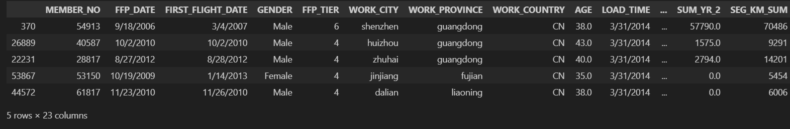

# **Airline Customer Value Analysis Case**
### Author : Althaaf Athaayaa Daffa Qushayyizidane


## **About Dataset**

> Context: 

#### Dataset ini berisi data customer sebuah perusahaan penerbangan dan beberapa fitur yang dapat menggambarkan value dari customer tersebut.
<br>
<br>

## Description


<br>
<br>
<br>

## **Steps**

- #### EDA
- #### Feature Engineering
- #### Modeling + Evaluasi
- #### Interpretasi model + Rekomendasi
<br>
<br>
<br>

# **Getting Started**

## **Import Library**

```sh
# Melakukan import library
import warnings
warnings.filterwarnings('ignore')

import numpy as np
import pandas as pd
import seaborn as sns
from scipy import stats
import matplotlib.pyplot as plt
from matplotlib import rcParams
%matplotlib inline


print('numpy version : ',np.__version__)
print('pandas version : ',pd.__version__)
print('seaborn version : ',sns.__version__)
```
<br>
<br>
<br>

## **Load Data**

```sh
df = pd.read_csv("flight.csv")
df.sample(5)
```

<br>
<br>
<br>

## **Exploratory Data Analysis (EDA)**

### Describe Data


#### Melakukan Pengecekan Type Data
#### Dataframe terdiri dari 23 kolom dan 62988 baris.
#### Dataframe memiliki kolom dengan 8 kategorikal, dan 15 numerikal.
#### Terdapat 4 kolom yang seharusnya merupakan datetime yaitu FFP_DATE, FIRST_FLIGHT_DATE, LOAD_TIME, LAST_FLIGHT_DATE.
<br>
<br>
<br>

### Merubah Tipe Data

```sh
from datetime import datetime

df['FFP_DATE'] = pd.to_datetime(df['FFP_DATE'])
df['FIRST_FLIGHT_DATE'] = pd.to_datetime(df['FIRST_FLIGHT_DATE'])
df['LOAD_TIME'] = pd.to_datetime(df['LOAD_TIME'])

df
```
#### Merubah tipe data 4 kolom yaitu kolom `FFP_DATE`, `FIRST_FLIGHT_DATE`, `LOAD_TIME`, `LAST_FLIGHT_DATE` menajadi **datetime**
<br>
<br>
<br>

### Checking Missing Value


#### Terdapat **7 kolom** missing value yaitu `Gender` 3 baris, `work_city` 2269 baris, `work_province` 3248 baris, `work_country` 26 baris, `age` 420 baris, `sum_yr_1` 551 baris dan `sum_yr_2` 138 baris.
<br>
<br>
<br>

### Group Column by Type

```sh
# Pengelompokan kolom berdasarkan jenisnya
num = ['int64', 'int32', 'int16', 'float64', 'float32', 'float16']
num = df.select_dtypes(include=num)
num.drop(columns=['MEMBER_NO'], inplace=True)
num = num.columns
cats = ['object', 'bool']
cats = df.select_dtypes(include=cats)
cats = cats.columns

timestamp = ['FFP_DATE', 'FIRST_FLIGHT_DATE', 'LOAD_TIME']
```
<br>
<br>
<br>

### Univariate Analysis


#### Dari boxplot dan violinplot diatas didapatkan insight bahwa rata-rata fitur mempunyai outlier yang sangat banyak.
<br>
<br>


#### Dari distplot diatas didapatkan insight bahwa fitur yang mempunyai outlier cenderung positive skewed.
<br>
<br>
<br>

### Multivariate Analysis


#### Dari heatmap disamping banyak fitur-fitur yang mempunyai korelasi yang sangat tinggi `>0.7`
<br>
<br>
<br>

### Data Cleansing

```sh
# Mengecek missing value ditiap fitur
x = df.shape[0]
missing_values_count = df.isnull().sum()
missing_values_count
```


#### Setelah dicek missing value maka didapatkan data ada beberapa fitur yang kosong diantaranya:
- #### `Gender` 3 baris
- #### `work_city` 2269 baris
- #### `work_province` 3248 baris
- #### `work_country` 26 baris
- #### `age` 420 baris
- #### `sum_yr_1` 551 baris
- #### `sum_yr_2` 138 baris
<br>
<br>

```sh
# Menghitung besarnya missing value dibandingkan keseluruhan data di dataset
total_cells = np.product(df.shape)
total_missing = missing_values_count.sum()

percent_missing = round((total_missing/total_cells) * 100,2)
print(f'{percent_missing}%')


0.46%
```

```sh
# Imputasi fitur numerik yang memiliki nilai NULL/NaN
df['AGE'].fillna(df['AGE'].mean(), inplace=True)
df['SUM_YR_1'].fillna(df['SUM_YR_1'].mean(), inplace=True)
df['SUM_YR_2'].fillna(df['SUM_YR_2'].mean(), inplace=True)
```

```sh
# Imputasi fitur kategorik yang memiliki nilai NULL/NaN
df['WORK_CITY'].fillna(df['WORK_CITY'].mode()[0], inplace=True)
df['WORK_PROVINCE'].fillna(df['WORK_PROVINCE'].mode()[0], inplace=True)
df['WORK_COUNTRY'].fillna(df['WORK_COUNTRY'].mode()[0], inplace=True)
```

#### Dari fitur yang mempunyai missing value kemudian dilakukan imputasi, untuk numerik imputasi dengan nilai `mean`, sedangkan fitur kategori dilakukan imputasi dengan `mode`.
<br>
<br>
<br>

### Data Duplicate

```sh
df.duplicated().sum()


0
```

#### Dari pengecekan data duplikat, tidak terdapat data duplikat.
<br>
<br>
<br>

### Handling Outliers

#### Dari grafik yang kita keluarkan ketika EDA, kita tahu bahwa hampir semua kolom numerik memiliki outlier. Sebelum kita mengeluarkan outlier, karena kita tahu bahwa bentuk distribusi kolom-kolom ini condong ke positive skewed, kita coba normalkan dengan log transformation kecuali untuk kolom `FPP_TIER`, `AGE`, `avg_discount`


```sh
for k in num:
 if k not in ['FPP_TIER', 'AGE', 'avg_discount']:
  df[k] = np.log(df[k] + (df[df[k] > 0][k].min() / 2)) # kita harus pastikan data tidak 0 untuk dilogtransform
```


### Perhatikan bahwa sekarang hampir semua kolom numerik terlihat memiliki distribusi berbentuk cukup normal. Untuk distribusi normal, kita bisa menggunakan z-score untuk membuang outlier seperti slide berikutnya.

```sh
print("Before removing outlier: ", len(df))

for n in num:
  if n not in ['FPP_TIER', 'AGE', 'avg_discount']:
    z_scores = np.abs(stats.zscore(df[n]))
    df = df[z_scores <= 3]

print("After removing outlier: ", len(df))


Before removing outlier:  62988
After removing outlier:  55341
```

#### Seperti yang terlihat di atas, kita menghapus sekitar ~7.647 baris yang berisi outlier berdasarkan z-score.
<br>
<br>
<br>

### Feature Engineering

#### Mengubah tipe data object ke datetime

```sh
#karena kolom "LAST_FLIGHT_DATE" ada yang eror, kita menggunakan errors='coerce', karena dia bakal skip error dan ganti datanya jadi NaT, lalu mengubah menjadi datetime
df["LAST_FLIGHT_DATE"] = pd.to_datetime(df["LAST_FLIGHT_DATE"], errors='coerce')
df[["FFP_DATE", "FIRST_FLIGHT_DATE","LOAD_TIME"]] = df[["FFP_DATE", "FIRST_FLIGHT_DATE","LOAD_TIME"]].apply(pd.to_datetime)
df.info()
```

<br>
<br>
<br>

#### Membuat feature untuk melihat customer yang lamanya bergabung

```sh
# Membuat feature untuk melihat customer yang lamanya bergabung 
df['COUNT_DAY_FLIGHT'] = df['LOAD_TIME'] - df['FFP_DATE']
df['COUNT_DAY_FLIGHT'] = df['COUNT_DAY_FLIGHT'].dt.days
```
<br>
<br>

#### Membuat Segmentasi

```sh
feats = ['COUNT_DAY_FLIGHT', 'LAST_TO_END', 'FLIGHT_COUNT', 'SEG_KM_SUM', 'avg_discount']
df_feat = df[feats]
df_feat.info()
```
<br>
<br>

#### Melakukan standardisasi dengan StandardScaler

```sh
# Melakukan standardisasi dengan StandardScaler
from sklearn.preprocessing import MinMaxScaler, StandardScaler

scaler = StandardScaler()
scaler.fit(df_feat)
x_std = scaler.transform(df_feat)
df_std = pd.DataFrame(x_std, columns = df_feat.columns)
```
<br>
<br>
<br>

## Modelling 

#### Melakukan evaluasi Elbow Methods menggunakan inertia untuk mencari cluster optimal dari dataset.

```sh
inertia = []

for i in range(1,11):
    kmeans = KMeans(n_clusters = i, random_state = 42)
    kmeans.fit(df_std)
    inertia.append(kmeans.inertia_)
```

```sh
from matplotlib import patches
from matplotlib.patches import Ellipse

sns.lineplot(x=range(1,11), y = inertia, color = 'purple')
sns.scatterplot(x=range(1,11), y = inertia, s = 50, color = 'blue')
circle = patches.Ellipse((5, 127000), width=0.18, height=10000, color='red', fill=False, linewidth=2)
plt.gca().add_patch(circle)
plt.gca().autoscale_view()
plt.show()
```
<br>
<br>

#### Hasil visualisasi inertia. Dapat dilihat dari evaluasi inertia n cluster dengan perubahan inertia yang signifikan adalah 5.


```sh
0    0.00053
1    0.00061
2    0.00069
3    0.00078
4    0.00085
5    0.00093
6    0.00102
7    0.00108
8    0.00113
9        NaN
dtype: float64
```
<br>
<br>
<br>

#### Mengimplementasikan K-Means Clustering dengan clusters sebanyak 5

```sh
kmeans = KMeans(n_clusters=5, random_state=42)
kmeans.fit(df_std)
df_std['Labels'] = kmeans.labels_
df_std.sample(5)
```


<br>
<br>
<br>

### PCA

#### Melakukan PCA menjadi 2 komponen x (PC1) dan y (PC2).

```sh
# Melakukan PCA
pca = PCA(n_components=2)

pca.fit(df_std)
pcas = pca.transform(df_std)

# Mengubah hasil pca ke dataframe
df_pca = pd.DataFrame(data = pcas, columns = ['PC1', 'PC2'])
df_pca.describe()
```


<br>
<br>
<br>


#### Persebaran dari sebelum (Pairplot) dilakukan PCA dan sesudah (Scatterplot)
<br>
<br>
<br>

## Interpretasi Model & Rekomendasi

### Summary

- #### `Labels 0` merupakan customer yang memiliki rata-rata jumlah penerbangan paling rendah (1.4) dan median hari tergabung sebagai member terendah (825 hari).
- #### `Labels 1` merupakan customer yang memiliki rata-rata jumlah penerbangan sedang (2.4), akan tetapi rata-rata jarak penerbangan yang ditempuh cukup tinggi (9.6 km).
- #### `Labels 2` merupakan customer yang memiliki rata-rata jumlah penerbangan paling tinggi (3.2),  dan rata-rata jarak penerbangan paling tinggi (10.4 km).
- #### `Labels 3` merupakan customer dengan rata-rata jumlah penerbangan cukup rendah (1.6), dan juga jarak yang ditenmpuh terendah akan tetapi tidak berbeda jauh dengan Labels 2 (8.4)
- #### `Labels 4` merupakan customer yang rata-rata telah mendaftar sebagai member cukup lama (2504 hari), akan tetapi rata-rata jumlah penerbangannya cukup rendah (1.9).
<br>
<br>

### Business Recomendation

#### Dapat memberi diskon tambahan untuk customer yang sudah lama menjadi member di labels 3 untuk meningkatkan jumlah penerbangan yang rendah


